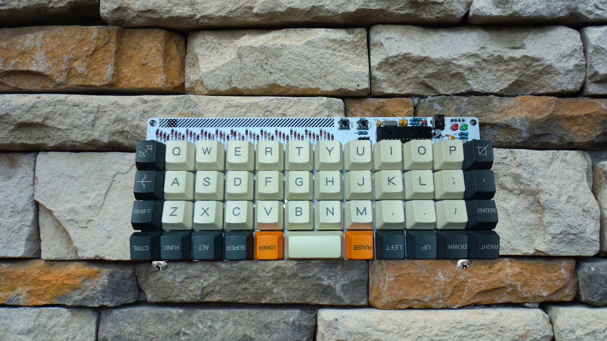

## Plaid

#### COLEMAK
```
,-----------------------------------------------------------------------------------.
| Tab  |   Q  |   W  |   F  |   P  |   G  |   J  |   L  |   U  |   Y  |   ;  | Bksp |
|------+------+------+------+------+-------------+------+------+------+------+------|
| Esc  |   A  |   R  |   S  |NAV_T |   D  |   H  |   N  |   E  |   I  |   O  |  "   |
|------+------+------+------+------+------|------+------+------+------+------+------|
| Shift|LALT Z|LCTL X|LSFT C|   V  |   B  |   K  |   M  |RSFT ,|RCFT .|   /  |Enter |
|------+------+------+------+------+------+------+------+------+------+------+------|
| Ctrl | RAlt | Alt  | GUI  |Lower |    Space    |Raise | Left |  Up  | Down |Right |
`-----------------------------------------------------------------------------------'
```

#### LOWER
```
,-----------------------------------------------------------------------------------.
|      |      |      |      |      |      |   (  |   )  |   =  |   &  |   |  |  DEL |
|------+------+------+------+------+-------------+------+------+------+------+------|
|      |      |      |      |      |      |   {  |   }  |   _  |   $  |   #  |  '   |
|------+------+------+------+------+------|------+------+------+------+------+------|
|      |      |      |      |      |      |   [  |  ]   |   <  |   >  |   \  |      |
|------+------+------+------+------+------+------+------+------+------+------+------|
|      |      |      |      |      |    ENTER     |      | Next | Vol- | Vol+ | Play |
`-----------------------------------------------------------------------------------'
```

#### RAISE
```
,-----------------------------------------------------------------------------------.
|      |   /  |   1  |   2  |   3  |   -  |  F1  |  F2  |  F3  |  F4  |      |      |
|------+------+------+------+------+------+------+------+------+------+------+------|
|      |  *   |   4  |   5  |   6  |   +  |  F5  |  F6  |  F7  |  F8  |      |      |
|------+------+------+------+------+------+------+------+------+------+------+------|
|      |  %   |   7  |   8  |   9  |   0  |  F9  |  F10 |  F11 |  F12 |      |      |
|------+------+------+------+------+------+------+------+------+------+------+------|
|      |      |      |      |      |     BSPC    |      | Next | Vol- | Vol+ | Play |
`-----------------------------------------------------------------------------------'
```

#### SPACE
```
,-----------------------------------------------------------------------------------.
|  ESC |      |      |   €  |   £  |   ğ  |      |      |  ü   |      |  :   |  DEL |
|------+------+------+------+------+------+------+------+------+------+------+------|
|      |  !   |  @   |   ş  |   ₺  |      |      |      |   I  |   ı  |  ö   |  `   |
|------+------+------+------+------+------+------+------+------+------+------+------|
|      |      |      |LSFT ç|      |      |      |      |  ^   |   ~  |  ?   |      |
|------+------+------+------+------+------+------+------+------+------+------+------|
|      |      |      |      |      |             |      |      |      |      |      |
`-----------------------------------------------------------------------------------'
```

#### NAVIGATION
```
,-----------------------------------------------------------------------------------.
|      |      |      |      |      |      | MPRV | PGUP |  UP  |      |      |      |
|------+------+------+------+------+------+------+------+------+------+------+------|
|      |      |      |      |      |      | HOME | LEFT | DOWN | RGHT | END  | MPLY |
|------+------+------+------+------+------+------+------+------+------+------+------|
|      |      |      |      |      |      | MNXT |PGDOWN|      |VLDOWN| VLUP | MUTE |
|------+------+------+------+------+------+------+------+------+------+------+------|
|      |      |      |      |      |             |      |      |      |      |      |
`-----------------------------------------------------------------------------------'
```

#### QWERTY
```
,-----------------------------------------------------------------------------------.
| Tab  |   Q  |   W  |   E  |   R  |   T  |   Y  |   U  |   I  |   O  |   P  | Bksp |
|------+------+------+------+------+-------------+------+------+------+------+------|
| Esc  |   A  |   S  |   D  |   F  |   G  |   H  |   J  |   K  |   L  |   ;  |  "   |
|------+------+------+------+------+------|------+------+------+------+------+------|
| Shift|   Z  |   X  |   C  |   V  |   B  |   N  |   M  |   ,  |   .  |   /  |Enter |
|------+------+------+------+------+------+------+------+------+------+------+------|
| Ctrl | RAlt | Alt  | GUI  |Lower |    Space    |Raise | Left |  Up  | Down |Right |
`-----------------------------------------------------------------------------------'
``` 

#### DVORAK
```
,-----------------------------------------------------------------------------------.
| Tab  |   "  |   ,  |   .  |   P  |   Y  |   F  |   G  |   C  |   R  |   L  | Bksp |
|------+------+------+------+------+-------------+------+------+------+------+------|
| Esc  |   A  |   O  |   E  |   U  |   I  |   D  |   H  |   T  |   N  |   S  |  /   |
|------+------+------+------+------+------|------+------+------+------+------+------|
| Shift|   ;  |   Q  |   J  |   K  |   X  |   B  |   M  |   W  |   V  |   Z  |Enter |
|------+------+------+------+------+------+------+------+------+------+------+------|
| Ctrl | RAlt | Alt  | GUI  |Lower |    Space    |Raise | Left |  Up  | Down |Right |
`-----------------------------------------------------------------------------------'
```

#### ADJUST
```
,-----------------------------------------------------------------------------------.
|Reset |LED_1 |LED_2 |LED_3 |LED_4 |LED_5 |LED_6 |LED_7 |LED_8 |LED_9 |LED_0 |  Del |
|------+------+------+------+------+-------------+------+------+------+------+------|
|      |      |Mu mod|Aud on|Audoff|AGnorm|AGswap|      |      |Dvorak|Qwerty|Colemk|
|------+------+------+------+------+------|------+------+------+------+------+------|
|      |Voice-|Voice+|Mus on|Musoff|MIDIon|MIDIof|TermOn|Te.Off|      |      |      |
|------+------+------+------+------+------+------+------+------+------+------+------|
|      |      |      |      |      |             |      |      |      |      |      |
`-----------------------------------------------------------------------------------'
```